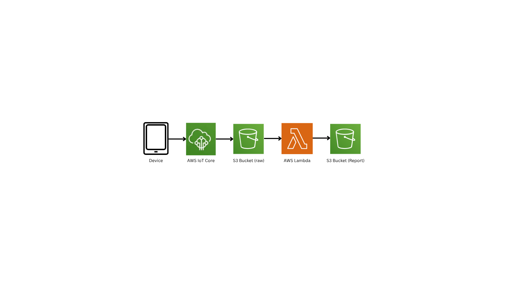

# IoT Data Pipeline on AWS

This project implements an event-driven IoT data processing pipeline on AWS using Terraform for infrastructure-as-code and GitHub Actions for CI/CD.

## Features

- Ingests simulated IoT device readings via AWS IoT Core
- Stores device data in versioned Amazon S3 bucket
- Generates daily summary reports using AWS Lambda + pandas
- Scheduled via Amazon EventBridge
- Fully automated infrastructure provisioning with Terraform
- CI/CD pipeline with GitHub Actions

---

## Architecture
<p align="center">  
    
</p>

---

## AWS Services Used

- AWS IoT Core
- Amazon S3 (with versioning)
- AWS Lambda (with pandas layer)
- Amazon EventBridge (for scheduling)
- AWS IAM (for access control)
- Terraform (for provisioning)
- GitHub Actions (CI/CD)

---

## Setup

### Prerequisites

- AWS CLI configured (`aws configure`)
- Terraform installed
- GitHub Actions secret: `AWS_ACCESS_KEY_ID`, `AWS_SECRET_ACCESS_KEY`, `AWS_REGION`

### Deployment

1. Clone this repo:

```bash
git clone https://github.com/Pranav5255/IoT-AWS-pipeline.git
cd IoT-AWS-pipeline
```

2. Initialize Terraform:
```
terraform init
```

3. Review the plan:
```
terraform plan
```

4. Apply the infra:
```
terraform apply
```

---

## Simulating IoT Data
You can simulate IoT data manually via AWS CLI:
```
aws iot-data publish \
  --topic 'iot/data' \
  --payload '{"device_id": "sensor-1", "timestamp": "2025-07-21T12:00:00Z", "temperature": 28.5, "humidity": 60}' \
  --endpoint-url <your-iot-endpoint>
```
---

## Testing the Lambda
You can test the report generation manually from the AWS Console:
- Navigate to Lambda > `iot-pipeline_daily_report`.
- Run a test with no payload.
Output report will appear in:
```
s3://iot-pipeline-data-bucket/report/YYYY-MM-DD.csv
```
---
## CI/CD Workflow:
On every push to `main`:
- Terraform plans and applies infra changes
- Uses OIDC-based GitHub Actions IAM role
- Lambda function and infra auto-updated
---

## IAM Notes
GitHub CI user needs these permissions:
- `iot:*` (or scoped access to topic rules)
- `lambda:*`
- `events:*`
- `s3:*`
- `iam:GetRole`, `iam:PassRole`

---

## File Structure
```
IoT-AWS-Pipeline/
├── lambda/
│   └── daily_report_generator.py
├── terraform/
│   ├── main.tf
│   ├── variables.tf
│   ├── outputs.tf
│   ├── provider.tf
└── .github/workflows/
    └── terraform.yml
```


